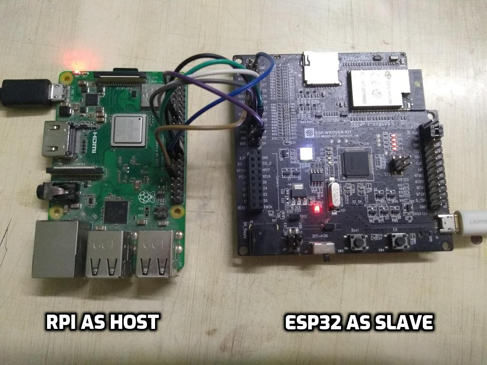
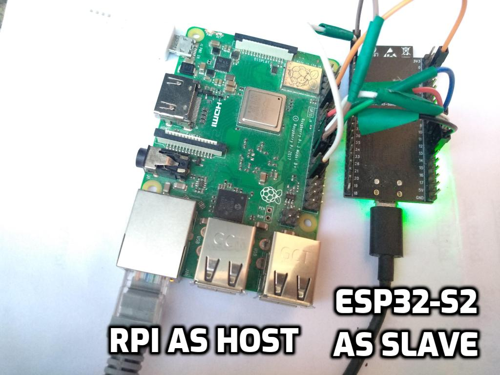

## Wi-Fi and BT/BLE connectivity Setup over SPI
### Hardware Setup/Connections
In this setup, ESP board acts as a SPI peripheral and provides Wi-FI capabilities to host. Please connect ESP peripheral to Raspberry-Pi with jumper cables as mentioned below. It may be good to use small length cables to ensure signal integrity. Power ESP32 and Raspberry Pi separately with a power supply that provide sufficient power. ESP32 can be powered through PC using micro-USB cable.

#### ESP32 setup
| Raspberry-Pi Pin | ESP32 Pin | Function |
|:-------:|:---------:|:--------:|
| 24 | IO5 | CS0 |
| 23 | IO18 | SCLK |
| 21 | IO19 | MISO |
| 19 | IO23 | MOSI |
| 25 | GND | Ground |
| 11 | IO2 | Handshake |
| 13 | IO4 | Data Ready |
| 31 | EN  | ESP32 Reset |

Setup image is here.



#### ESP32-S2 setup
| Raspberry-Pi Pin | ESP32-S2 Pin | Function |
|:----------------:|:------------:|:--------:|
| 24 | IO10 | CS0 |
| 23 | IO12 | SCLK |
| 21 | IO13 | MISO |
| 19 | IO11 | MOSI |
| 25 | GND | Ground |
| 11 | IO2 | Handshake |
| 13 | IO4 | Data ready |
| 31 | RST | ESP32 Reset |

Setup image is here.



### Software setup
The SPI master driver is disabled by default on Raspberry Pi OS. To enable it add following commands in  _/boot/config.txt_ file
```
dtparam=spi=on
dtoverlay=disable-bt
```
Please reboot Raspberry-Pi after changing this file.


### ESP peripheral setup
#### ESP-IDF requirement
Following table explains ESP-IDF version required to make ESP-Hosted solution work on corresponding ESP peripheral.

| ESP peripheral | ESP-IDF release |
|:----:|:----:|
| ESP32 | release v4.0 |
| ESP32-S2 | release v4.2 |

#### Using pre-built binary
For pre built hosted mode firmware is present in `release` tab. To flash it on ESP peripheral, edit <serial_port> with ESP peripheral's serial port and run following command.
##### ESP32
```sh
esptool.py -p <serial_port> -b 960000 --before default_reset --after hard_reset write_flash --flash_mode dio --flash_freq 40m --flash_size detect 0x8000 partition-table_spi_v0.3.bin 0x1000 bootloader_spi_v0.3.bin 0x10000 esp_hosted_firmware_spi_v0.3.bin
```
##### ESP32-S2
```sh
esptool.py -p <serial_port> -b 960000 --before default_reset --after hard_reset --chip esp32s2  write_flash --flash_mode dio --flash_size detect --flash_freq 80m 0x1000 bootloader_spi_v0.3.bin 0x8000 build/partition_table/partition-table_spi_v0.3.bin 0x10000 esp_hosted_firmware_spi_v0.3.bin
```
For windows user, you can also program the binaries using ESP Flash Programming Tool.

#### Compilation using source
Please use above mentioned ESP-IDF repository release branch for your ESP peripheral.
The control path between host and ESP peripheral is based on `protobuf`. For that `protocomm` layer from ESP-IDF is used. Run following command to make `protocomm_priv.h` available for control path.
```
$ git mv components/protocomm/src/common/protocomm_priv.h components/protocomm/include/common/
```

Navigate to `esp/esp_driver/network_adapter` directory

##### Using make

:warning: *make* build system is only supported till ESP32. Please refer cmake section below for ESP32-S2.

```
$ make clean
```

Run following command and navigate to `Example Configuration ->  Transport layer -> SPI interface -> select` and exit from menuconfig.
```
$ make menuconfig
```

To build and flash the app on ESP peripheral, run

```sh
$ make
$ make flash
```
##### Using cmake

```
$ idf.py fullclean
```
:warning: Skip this step for ESP32. Run for ESP32-S2 only.
```
$ idf.py set-target esp32s2
```

Run following command and navigate to `Example Configuration -> Transport layer -> SPI interface -> select` and exit from menuconfig. Read more about [idf.py](https://docs.espressif.com/projects/esp-idf/en/latest/esp32s2/api-guides/build-system.html#using-the-build-system) here.
```
$ idf.py menuconfig
```

To build and flash the app on ESP peripheral, run

```sh
$ idf.py -p <serial_port> build flash
```

## Checking the Setup for SPI
Once ESP peripheral has a valid firmware and booted successfully, you should be able to see successful enumeration on Raspberry Pi side as:
```sh
$ dmesg
[   47.150740] OF: overlay: WARNING: memory leak will occur if overlay removed, property: /soc/spi@7e204000/spidev@0/status
[   47.346754] Bluetooth: Core ver 2.22
[   47.346812] NET: Registered protocol family 31
[   47.346815] Bluetooth: HCI device and connection manager initialized
[   47.346830] Bluetooth: HCI socket layer initialized
[   47.346837] Bluetooth: L2CAP socket layer initialized
[   47.346856] Bluetooth: SCO socket layer initialized
[   65.589406] esp32_spi: loading out-of-tree module taints kernel.
[   65.591409] esp32: Resetpin of Host is 6
[   65.591541] esp32: Triggering ESP reset.
[   65.593385] ESP32 device is registered to SPI bus [0],chip select [0]
[   66.201597] Received INIT event from esp32
[   66.201613] ESP32 capabilities: 0x78
[   66.619381] Bluetooth: BNEP (Ethernet Emulation) ver 1.3
[   66.619388] Bluetooth: BNEP filters: protocol multicast
[   66.619404] Bluetooth: BNEP socket layer initialized
```
